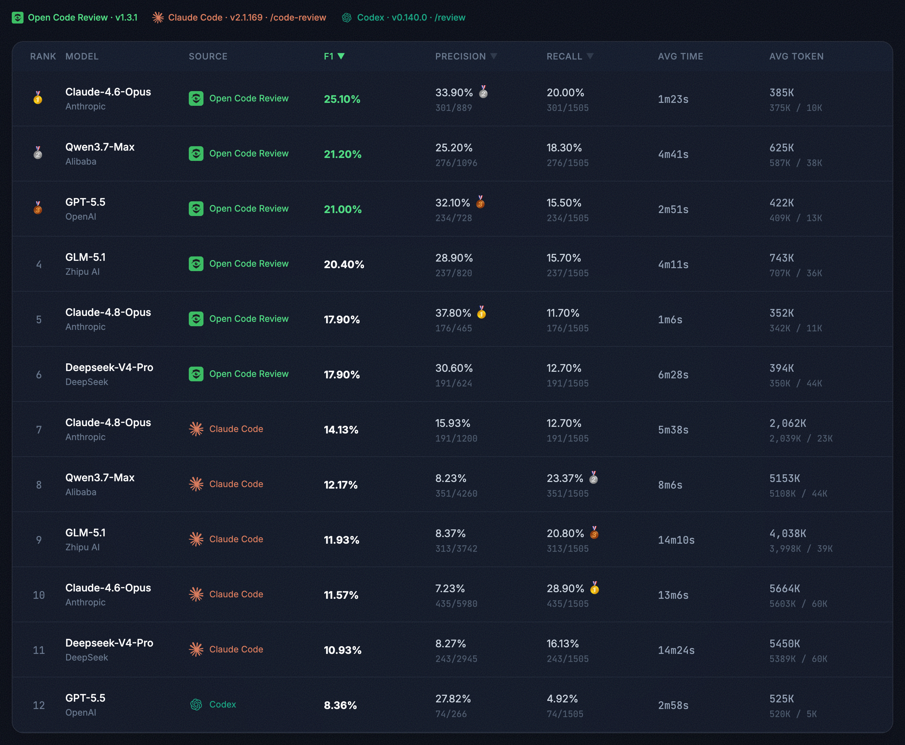

<div align="center">
  <a href="https://alibaba.github.io/open-code-review/">
    
  </a>
  <h1>OpenCodeReview</h1>
</div>

<p align="center">
  <a href="https://trendshift.io/repositories/41087" target="_blank">
    
  </a>
</p>
<p align="center">
  <a href="https://www.npmjs.com/package/@alibaba-group/open-code-review"></a>
  <a href="https://github.com/alibaba/open-code-review/actions/workflows/release.yml"></a>
  <a href="https://goreportcard.com/report/github.com/alibaba/open-code-review"></a>
  <a href="https://github.com/alibaba/open-code-review/blob/main/LICENSE"></a>
  <a href="https://deepwiki.com/alibaba/open-code-review"></a>
  <a href="https://www.bestpractices.dev/projects/13328"></a>
</p>
<p align="center">
  <a href="#supported-platforms"></a>
  <a href="#supported-platforms"></a>
  <a href="#supported-platforms"></a>
  <a href="#supported-agents"></a>
  <a href="#supported-agents"></a>
  <a href="#supported-agents"></a>
</p>
<p align="center">
  English | <a href="README.zh-CN.md">简体中文</a> | <a href="README.ja-JP.md">日本語</a> | <a href="README.ko-KR.md">한국어</a> | <a href="README.ru-RU.md">Русский</a>
</p>

---

## What is Open Code Review?

Open Code Review is an AI-powered code review CLI tool. It originated as Alibaba Group's internal official AI code review assistant — over the past two years, it has served tens of thousands of developers and identified millions of code defects. After thorough validation at massive scale, we incubated it into an open source project for the community. Simply configure a model endpoint to get started.

It reads Git diffs, sends changed files to a configurable LLM via an agent with tool-use capabilities, and generates structured review comments with line-level precision. The agent can read full file contents, search the codebase, inspect other changed files for context, and produce deep reviews — not just surface-level diff feedback. Beyond diff review, `ocr scan` reviews entire files for auditing unfamiliar codebases or directories that have no meaningful diff.


## Benchmark

> Compared to general-purpose agents (Claude Code), Open Code Review achieves significantly higher **Precision** and **F1** with the same underlying model, while consuming only **~1/9 of the tokens** and completing reviews faster. Note that its Recall is lower than general-purpose agents — a deliberate trade-off favoring precision over noise.

A real-world code review benchmark built from **50** popular open-source repositories, **200** real Pull Requests, and **10** programming languages — cross-validated by 80+ senior engineers (**1,505** annotated ground-truth issues).

| Metric | What it measures | Why it matters |
|--------|-----------------|----------------|
| **F1** | Harmonic mean of precision and recall | Best single number for overall review quality |
| **Precision** | Proportion of reported issues that are real defects | Higher = fewer false alarms to triage |
| **Recall** | Proportion of real defects that are found | Higher = fewer issues slip through review |
| **Avg Time** | Wall-clock time per review | Matters for CI pipeline latency |
| **Avg Token** | Total tokens consumed per review | Directly impacts API cost |



## Why Open Code Review?

### The Problem with General-Purpose Agents

If you've used general-purpose agents like Claude Code with Skills for code review, you've likely encountered these pain points:

- **Incomplete coverage** — On larger changesets, agents tend to "cut corners," selectively reviewing only some files and missing others.
- **Position drift** — Reported issues frequently don't match the actual code location, with line numbers or file references drifting off target.
- **Unstable quality** — Natural-language-driven Skills are hard to debug, and review quality fluctuates significantly with minor prompt variations.

The root cause: a purely language-driven architecture lacks hard constraints on the review process.

### Core Design: Deterministic Engineering × Agent Hybrid

Open Code Review's core philosophy is to combine deterministic engineering with an agent, each handling what it does best.

**Deterministic Engineering — Hard Constraints**

For review steps that *must not go wrong*, engineering logic — not the language model — guarantees correctness:

- **Precise file selection** — Determines exactly which files need review and which should be filtered, ensuring no important change is missed.
- **Smart file bundling** — Groups related files into a single review unit (e.g., `message_en.properties` and `message_zh.properties` are bundled together). Each bundle runs as a sub-agent with isolated context — a divide-and-conquer strategy that stays stable on very large changesets and naturally supports concurrent review.
- **Fine-grained rule matching** — Matches review rules to each file's characteristics, keeping the model's attention sharply focused and eliminating information noise at the source. Compared to purely language-driven rule guidance, template-engine-based rule matching is more stable and predictable.
- **External positioning and reflection modules** — Independent comment-positioning and comment-reflection modules systematically improve both the location accuracy and content accuracy of AI feedback.

**Agent — Dynamic Decision-Making**

The agent's strengths are concentrated where they matter most — dynamic decisions and dynamic context retrieval:

- **Scenario-tuned prompts** — Prompt templates deeply optimized for code review, improving effectiveness while reducing token consumption.
- **Scenario-tuned toolset** — Distilled from deep analysis of tool-call traces in large-scale production data — including call frequency distributions, per-tool repetition rates, and the impact of new tools on the overall call chain — resulting in a purpose-built toolset that is more stable and predictable for code review than a generic agent toolkit.

## How to Use

### CLI

#### Install

**Via NPM (Recommended)**

```bash
npm install -g @alibaba-group/open-code-review
```

After installation, the `ocr` command is available globally.

**From GitHub Release**

Install the latest binary for your OS/architecture with one command (macOS / Linux):

```bash
curl -fsSL https://raw.githubusercontent.com/alibaba/open-code-review/main/install.sh | sh
```

The script picks the right release binary, verifies its SHA-256 checksum, and installs it as `ocr` in `/usr/local/bin`. Override the target with `OCR_INSTALL_DIR` or pin a release with `OCR_VERSION`:

```bash
OCR_INSTALL_DIR="$HOME/.local/bin" OCR_VERSION=v1.3.13 \
  sh -c "$(curl -fsSL https://raw.githubusercontent.com/alibaba/open-code-review/main/install.sh)"
```

<details>
<summary>Manual download (all platforms, including Windows)</summary>

Download the binary for your platform from [GitHub Releases](https://github.com/alibaba/open-code-review/releases):

```bash
# macOS (Apple Silicon)
curl -Lo ocr https://github.com/alibaba/open-code-review/releases/latest/download/opencodereview-darwin-arm64
chmod +x ocr && sudo mv ocr /usr/local/bin/ocr

# macOS (Intel)
curl -Lo ocr https://github.com/alibaba/open-code-review/releases/latest/download/opencodereview-darwin-amd64
chmod +x ocr && sudo mv ocr /usr/local/bin/ocr

# Linux (x86_64)
curl -Lo ocr https://github.com/alibaba/open-code-review/releases/latest/download/opencodereview-linux-amd64
chmod +x ocr && sudo mv ocr /usr/local/bin/ocr

# Linux (ARM64)
curl -Lo ocr https://github.com/alibaba/open-code-review/releases/latest/download/opencodereview-linux-arm64
chmod +x ocr && sudo mv ocr /usr/local/bin/ocr

# Windows (x86_64) — move ocr.exe to a directory in your PATH
curl -Lo ocr.exe https://github.com/alibaba/open-code-review/releases/latest/download/opencodereview-windows-amd64.exe

# Windows (ARM64) — move ocr.exe to a directory in your PATH
curl -Lo ocr.exe https://github.com/alibaba/open-code-review/releases/latest/download/opencodereview-windows-arm64.exe
```

</details>

**From Source**

```bash
git clone https://github.com/alibaba/open-code-review.git
cd open-code-review
make build
sudo cp dist/opencodereview /usr/local/bin/ocr
```

#### Quick Start

**1. Configure LLM**

**You must configure an LLM before reviewing code.**

OCR manages LLM configuration through a unified **Provider** system. It ships with many popular built-in providers and also supports adding custom providers to connect to private deployments or other compatible endpoints. Config is stored in `~/.opencodereview/config.json`.

**Option A: Interactive setup (Recommended)**

```bash
ocr config provider          # Select a built-in provider or add a custom one
ocr config model             # Pick a model for the active provider
```


The interactive UI guides you through provider selection, API key entry, and model configuration, then automatically tests connectivity.

Run `ocr llm providers` to see all built-in providers. Built-in providers come with preset API URLs and protocols — just supply an API key to get started. If the corresponding environment variable is already set (e.g. `ANTHROPIC_API_KEY`, `OPENAI_API_KEY`), the API key is picked up automatically.

**Custom providers** can also be added through the interactive UI — you'll need to provide a name, API URL, protocol type (`anthropic` or `openai`), and API key.

**Option B: CLI setup (for CI/CD and non-interactive environments)**

Use `ocr config set` to write provider configuration directly, suitable for scripts and automation.

Using a built-in provider:

```bash
ocr config set provider anthropic
ocr config set providers.anthropic.api_key your-api-key-here
ocr config set providers.anthropic.model claude-sonnet-4-6
```

Using a custom provider (private gateway or other compatible endpoint):

```bash
ocr config set provider my-gateway
ocr config set custom_providers.my-gateway.url https://my-llm-gateway.internal/v1
ocr config set custom_providers.my-gateway.protocol openai
ocr config set custom_providers.my-gateway.api_key your-api-key-here
ocr config set custom_providers.my-gateway.model gpt-4o
```

> `url` and `protocol` are required for custom providers. Supported protocols: `anthropic`, `openai`.

Optional settings:

| Key | Description |
|-----|-------------|
| `providers.<name>.auth_header` | Auth header: `x-api-key` or `authorization` (default: `authorization`) |
| `providers.<name>.extra_body` | Custom JSON fields merged into the request body |
| `providers.<name>.models` | Model list for interactive selection |

**Environment variables (highest priority)**

Environment variables override config file settings, useful in CI/CD where writing config files is inconvenient:

```bash
export OCR_LLM_URL=https://api.anthropic.com/v1/messages
export OCR_LLM_TOKEN=your-api-key-here
export OCR_LLM_MODEL=claude-opus-4-6
export OCR_USE_ANTHROPIC=true
```

Also compatible with Claude Code environment variables (`ANTHROPIC_BASE_URL`, `ANTHROPIC_AUTH_TOKEN`, `ANTHROPIC_MODEL`) and parses `~/.zshrc` / `~/.bashrc` for those exports.

> **Note for CC-Switch Users**: If you are using [CC-Switch](https://github.com/farion1231/cc-switch) with [routing service](https://www.ccswitch.io/en/docs?section=proxy&item=service) enabled, you can point the provider's `url` to the CC-Switch proxy address without additional configuration:
> - For **Claude** provider: set `providers.anthropic.url` to `http://127.0.0.1:15721`
> - For **Codex** provider: set the corresponding provider's `url` to `http://127.0.0.1:15721/v1`
> - `api_key` can be any value; `extra_body` settings still apply

**2. Test Connectivity**

```bash
ocr llm test
```

**3. Review**

```bash
cd your-project

# Workspace mode — review all staged, unstaged, and untracked changes
ocr review

# Branch range — compare two refs
ocr review --from main --to feature-branch

# Single commit
ocr review --commit abc123

# Full-file scan — review whole files instead of a diff (no git history needed)
ocr scan                          # scan the entire repository
ocr scan --path internal/agent    # scan a directory or specific files
```

### Integrate with Coding Agents

OCR can be seamlessly integrated into AI coding agents as a slash command, enabling code review directly within your agent workflow.

#### Option 1: Install as a Skill

Use `npx` to install the OCR skill into your project:

```bash
npx skills add alibaba/open-code-review --skill open-code-review
```

This installs the `open-code-review` skill from the [skills registry](skills/open-code-review/SKILL.md), which teaches your coding agent how to invoke `ocr` for code review, classify issues by priority, and optionally apply fixes.

#### Option 2: Install as a Claude Code Plugin

For [Claude Code](https://docs.anthropic.com/en/docs/claude-code), install the command plugin through the following command in Claude Code:

```bash
/plugin marketplace add alibaba/open-code-review
/plugin install open-code-review@open-code-review
```

This registers the `/open-code-review:review` slash command, which runs OCR and automatically filters and fixes issues.

#### Option 3: Install as a Codex Plugin

For local Codex, install the Open Code Review plugin from this repository:

```bash
codex plugin marketplace add alibaba/open-code-review
codex
/plugins
```

For a local checkout or fork:

```bash
codex plugin marketplace add .
codex
/plugins
```

Install and enable `Open Code Review`, then start a new Codex thread and invoke it explicitly:

```text
@Open Code Review review my current changes
@Open Code Review review this branch against main
@Open Code Review review and fix high-confidence issues
```

This registers a Codex skill that runs the local OCR CLI:

```bash
ocr review --audience agent
```

This integration does not change OCR's internal LLM backend and does not require configuring an OpenAI Responses API endpoint for Codex. OCR itself still requires the `ocr` CLI to be installed and configured as described in the CLI setup section.

Korean guide: [`plugins/open-code-review/CODEX.ko-KR.md`](plugins/open-code-review/CODEX.ko-KR.md)

#### Option 4: Install as a Cursor Plugin

For [Cursor](https://www.cursor.com/), install the Open Code Review plugin from this repository:

```
cursor-plugin marketplace add alibaba/open-code-review
```

Or add the marketplace manually. In Cursor, open `/plugins`, search for `Open Code Review`, and install it.

For a local checkout or fork:

```
cursor-plugin marketplace add .
```

After installation, invoke it in Cursor:

```text
@Open Code Review review my current changes
@Open Code Review review this branch against main
@Open Code Review review and fix high-confidence issues
```

This registers a Cursor skill that runs the local OCR CLI:

```bash
ocr review --audience agent
```

This integration does not change OCR's internal LLM backend. OCR itself still requires the `ocr` CLI to be installed and configured as described in the CLI setup section.

#### Option 5: Copy the Command File Directly

For a quick setup without any package manager, simply copy the command file to use the `/open-code-review` slash command in Claude Code.

**Project-level** (shared with team via git):

```bash
mkdir -p .claude/commands
curl -o .claude/commands/open-code-review.md \
  https://raw.githubusercontent.com/alibaba/open-code-review/main/plugins/open-code-review/commands/review.md
```

**User-level** (personal global use across all projects):

```bash
mkdir -p ~/.claude/commands
curl -o ~/.claude/commands/open-code-review.md \
  https://raw.githubusercontent.com/alibaba/open-code-review/main/plugins/open-code-review/commands/review.md
```

> **Prerequisite**: All integration methods require the `ocr` CLI to be installed and an LLM configured. See [Install](#install) and [Configure LLM](#1-configure-llm) above.

### CI/CD Integration

OCR can be integrated into CI/CD pipelines to automate code review on Merge Requests / Pull Requests.

The core command for CI integration:

```bash
ocr review \
  --from "origin/main" \
  --to "<commit_sha>" \
  --format json
```

The `--from` flag accepts a branch ref (e.g., `origin/main`) or commit SHA as the base, while `--to` accepts a commit SHA or branch ref as the head. In CI environments, using commit SHA for `--to` is recommended to correctly handle fork PRs/MRs where the source branch doesn't exist on the origin remote.

The `--format json` flag outputs machine-readable results suitable for parsing in CI scripts.

See the [`examples/`](./examples/) directory for integration examples:

- [`github_actions/`](./examples/github_actions/) — GitHub Actions integration example
- [`gitlab_ci/`](./examples/gitlab_ci/) — GitLab CI integration example

## Commands

| Command | Alias | Description |
|---------|-------|-------------|
| `ocr review` | `ocr r` | Start a diff-based code review |
| `ocr scan` | `ocr s` | Review whole files (no diff required) |
| `ocr rules check <file>` | — | Preview which review rule applies to a file path |
| `ocr config provider` | — | Interactive provider setup (built-in, custom, or manual) |
| `ocr config model` | — | Interactive model selection for the active provider |
| `ocr config set <key> <value>` | — | Set configuration values |
| `ocr config unset custom_providers.<name>` | — | Delete a custom provider |
| `ocr llm test` | — | Test LLM connectivity |
| `ocr llm providers` | — | List built-in LLM providers |
| `ocr viewer` | `ocr v` | Launch WebUI session viewer on `localhost:5483` |
| `ocr version` | — | Show version info |

### `ocr review` Flags

| Flag | Shorthand | Default | Description |
|------|-----------|---------|-------------|
| `--repo` | — | current dir | Git repository root |
| `--from` | — | — | Source ref (e.g., `main`) |
| `--to` | — | — | Target ref (e.g., `feature-branch`) |
| `--commit` | `-c` | — | Single commit to review |
| `--exclude` | — | — | Comma-separated gitignore-style patterns to skip; merged with rule.json excludes |
| `--preview` | `-p` | `false` | Preview which files will be reviewed without running the LLM |
| `--format` | `-f` | `text` | Output format: `text` or `json` |
| `--concurrency` | — | `8` | Max concurrent file reviews |
| `--timeout` | — | `10` | Concurrent task timeout in minutes |
| `--audience` | — | `human` | `human` (show progress) or `agent` (summary only) |
| `--background` | `-b` | — | Optional requirement/business context for the review; auto-filled from commit message when using `--commit` |
| `--model` | — | — | Select or override the LLM model for this review |
| `--rule` | — | — | Path to custom JSON review rules |
| `--max-tools` | — | built-in | Max tool call rounds per file; only takes effect when greater than template default |
| `--max-git-procs` | — | built-in | Max concurrent git subprocesses |
| `--tools` | — | — | Path to custom JSON tools config |

### `ocr scan` Flags

`ocr scan` reviews entire files rather than a diff — useful for auditing an unfamiliar
codebase, a pre-migration sweep, or any directory with no meaningful diff. It works in
non-git directories too (it falls back to a filesystem walk that honors `.gitignore`).

| Flag | Shorthand | Default | Description |
|------|-----------|---------|-------------|
| `--path` | — | whole repo | Comma-separated dirs/files to scan |
| `--exclude` | — | — | Comma-separated gitignore-style patterns to skip; merged with rule.json excludes |
| `--preview` | `-p` | `false` | List which files would be scanned without running the LLM |
| `--max-tokens-budget` | — | `0` (unlimited) | Cap total token usage; dispatch stops once exceeded |
| `--no-plan` | — | `false` | Skip the per-file planning pre-pass |
| `--no-dedup` | — | `false` | Skip per-batch de-duplication of similar comments |
| `--no-summary` | — | `false` | Skip the project-level summary |
| `--batch` | — | `by-language` | Batching strategy: `none`, `by-language`, or `by-directory` |
| `--format` | `-f` | `text` | Output format: `text` or `json` (JSON includes a `project_summary` field) |
| `--concurrency` | — | `8` | Max concurrent file scans |
| `--rule` | — | — | Path to custom JSON review rules |
| `--repo` | — | current dir | Repository or directory root to scan |

Before each run, `ocr scan` prints a rough token-cost estimate. Use `--preview` to see the
file list first, and `--max-tokens-budget` to cap spend on large repositories.

## Examples

```bash
# Interactive provider and model setup
ocr config provider
ocr config model
ocr llm providers

# Delete a custom provider
ocr config unset custom_providers.my-gateway

# Preview which files will be reviewed (no LLM calls)
ocr review --preview
ocr review -c abc123 -p

# Review workspace changes with default settings
ocr review

# Review branch diff with higher concurrency
ocr review --from main --to my-feature --concurrency 4

# Review a specific commit with verbose JSON output
ocr review --commit abc123 --format json --audience agent

# Select or override model for this review
ocr review --model claude-opus-4-6
ocr review --commit abc123 --model claude-sonnet-4-6

# Provide requirement context for more targeted review
ocr review --background "Adding rate limiting to the login API"

# Use custom review rules
ocr review --rule /path/to/my-rules.json

# Preview which rule applies to a file
ocr rules check src/main/java/com/example/Foo.java
ocr rules check --rule custom.json src/main/resources/mapper/UserMapper.xml

# Full-file scan: preview the file list first (no LLM calls)
ocr scan --preview

# Scan the whole repo, cap spend at ~500k tokens
ocr scan --max-tokens-budget 500000

# Scan a subdirectory, skipping generated/test files
ocr scan --path internal --exclude '**/*_test.go,**/generated/**'

# Scan a non-git directory with JSON output (includes project_summary)
ocr scan --repo /path/to/plain/dir --format json

# Fastest scan: skip planning, dedup, and the project summary
ocr scan --no-plan --no-dedup --no-summary

# View review session history in browser
ocr viewer
ocr viewer --addr :3000
```

### Viewer security

The viewer serves session JSONL contents (LLM request messages and responses) over HTTP. It enforces a Host-header allowlist on every request: loopback names (`localhost`, `127.0.0.0/8`, `::1`) and the concrete bind host are always allowed. Wildcard binds (`--addr :3000`, `--addr 0.0.0.0:3000`) and other non-loopback Hostnames must be added via the `OCR_VIEWER_ALLOWED_HOSTS` environment variable (comma-separated):

```bash
OCR_VIEWER_ALLOWED_HOSTS=review.internal,ocr.lan ocr viewer --addr :3000
```

This blocks DNS-rebinding attacks against the local viewer.

## Review Rules

OCR resolves review rules using a four-layer priority chain. Each layer uses first-match-wins: if a file path matches a pattern, that rule is used; otherwise it falls through to the next layer.

| Priority | Source | Path | Description |
|----------|--------|------|-------------|
| 1 (highest) | `--rule` flag | User-specified path | CLI explicit override |
| 2 | Project config | `<repoDir>/.opencodereview/rule.json` | Per-project rules, can be committed to git |
| 3 | Global config | `~/.opencodereview/rule.json` | User-wide personal preferences |
| 4 (lowest) | System default | Embedded `system_rules.json` | Built-in rules covering common languages and file types |

### Rule File Format

Layers 1–3 share the same JSON format:

```json
{
  "rules": [
    {
      "path": "force-api/**/*.java",
      "rule": "All new methods must validate required parameters for null values",
      "merge_system_rule": true
    },
    {
      "path": "**/*mapper*.xml",
      "rule": "Check SQL for injection risks, parameter errors, and missing closing tags"
    }
  ]
}
```

- `path` supports `**` recursive matching and `{java,kt}` brace expansion.
- `merge_system_rule` is optional. When `true`, the matched built-in system rule is merged with this user rule; otherwise the user rule replaces the system rule.
- Within each layer, rules are evaluated in declaration order — the first match wins.
- If a rule file does not exist, it is silently skipped.

**The `rule` field supports both inline content and file paths.** The system auto-detects which one you mean:

1. If the value contains newlines → **inline content** (multi-line rules are never file paths).
2. If the value is a single line, contains no spaces, and ends with `.md` / `.txt` / `.markdown` → **file path**.
   - Absolute paths (starting with `/`) are used directly.
   - Relative paths are resolved against the project root. Path traversal (e.g. `../../etc/passwd.md`) is blocked. If not found, a `[WARN]` is emitted and the rule is cleared (no fallback to inline).
   - The file must pass validation: whitelisted extension, ≤ 512 KB, and resolved symlink target must also be a whitelisted extension. If validation fails, the rule is cleared.
3. Otherwise → **inline content**.

```json
{
  "rules": [
    {
      "path": "**/*mapper*.xml",
      "rule": "docs/sql-rules.md"
    },
    {
      "path": "**/*.java",
      "rule": "Always check for null safety and resource leaks"
    },
    {
      "path": "**/*.go",
      "rule": "shared/go-concurrency.md"
    },
    {
      "path": "**/*.py",
      "rule": "/Users/me/team-rules/python.md"
    }
  ]
}
```

- `docs/sql-rules.md` — relative path, resolved from `<project>/docs/sql-rules.md`.
- `Always check for null safety…` — inline string, used directly.
- `shared/go-concurrency.md` — relative path, same resolution.
- `/Users/me/team-rules/python.md` — absolute path, used directly.

> Absolute paths can access files outside the project directory — this is intentional. `rule.json` is authored by project maintainers, i.e. trusted input. Teams can store shared rules at a common path (e.g. `/opt/company-rules/`) instead of copying them into every project.

### Path Filtering

Rule files also support `include` and `exclude` fields to control which files enter the review scope:

```json
{
  "rules": [
    {"path": "**/*.java", "rule": "Check for null safety"}
  ],
  "include": ["src/main/**/*.java", "lib/**/*.kt"],
  "exclude": ["**/generated/**", "vendor/**"]
}
```

**Filter decision priority (highest to lowest):**

| Step | Condition | Result |
|------|-----------|--------|
| 1 | File is binary | Excluded |
| 2 | Path matches user `exclude` pattern | Excluded |
| 3 | File extension not in supported list | Excluded |
| 4 | `include` is configured and path matches | **Reviewed** (skips step 5) |
| 5 | Path matches built-in default exclude pattern (test files, etc.) | Excluded |
| 6 | None of the above | Reviewed |

**How it works:**

- `include` and `exclude` follow the same priority chain as review rules (`--rule` > project config > global config). The **highest-priority layer that has include/exclude configured** takes effect as a whole — patterns are not merged across layers.
- `exclude` always wins over `include` — a file matching both is excluded.
- `include` acts as a **bypass for built-in default exclude patterns** (e.g., test files), not as an exclusive allowlist — files not matching any `include` pattern still proceed through the default filter checks normally.
- Pattern syntax: supports `**` recursive matching, `*` single-segment matching, and `{a,b}` brace expansion. Matching is case-insensitive.

**Built-in default exclude patterns** (filters test files, etc. — can be overridden with `include`):

```
**/*_test.go, **/*Test.java, **/*Tests.java, **/*_test.rs,
**/*.test.{js,jsx,ts,tsx}, **/*.spec.{js,jsx,ts,tsx}, **/__tests__/**,
**/src/test/java/**/*.java, **/src/test/**/*.kt,
**/test/**/*_test.py, **/tests/**/*_test.py, **/*_test.py,
**/*_spec.rb, **/spec/**/*_spec.rb, **/oh_modules/**
```

## Configuration Reference

Config file: `~/.opencodereview/config.json`

| Key | Type | Example |
|-----|------|---------|
| `provider` | string | `anthropic` \| `openai` \| `dashscope` \| `deepseek` \| `z-ai` |
| `providers.<name>.api_key` | string | Provider-specific API key |
| `providers.<name>.url` | string | Provider base URL override |
| `providers.<name>.protocol` | string | `anthropic` \| `openai` |
| `providers.<name>.model` | string | Model name for the provider |
| `providers.<name>.models` | array | Optional provider model list for interactive selection |
| `providers.<name>.auth_header` | string | `x-api-key` \| `authorization` |
| `custom_providers.<name>.*` | — | Same fields as `providers.<name>.*`, including optional `models` |
| `llm.url` | string | `https://api.openai.com/v1/chat/completions` |
| `llm.auth_token` | string | `sk-xxxxxxx` |
| `llm.auth_header` | string | Anthropic only: `x-api-key` \| `authorization` |
| `llm.model` | string | `claude-opus-4-6` |
| `llm.use_anthropic` | boolean | `true` \| `false` |
| `language` | string | Any language name, e.g. `English`, `Chinese` (default: `English`) |
| `telemetry.enabled` | boolean | `true` \| `false` |
| `telemetry.exporter` | string | `console` \| `otlp` |
| `telemetry.otlp_endpoint` | string | OTLP collector address |
| `telemetry.content_logging` | boolean | Include prompts in telemetry |

Environment variables take precedence over the config file.

### Environment Variables

| Variable | Purpose |
|----------|---------|
| `OCR_LLM_URL` | LLM API endpoint URL |
| `OCR_LLM_TOKEN` | API key / auth token |
| `OCR_LLM_AUTH_HEADER` | Anthropic auth header (`x-api-key` or `authorization`) |
| `OCR_LLM_MODEL` | Model name |
| `OCR_USE_ANTHROPIC` | `true` = Anthropic, `false` = OpenAI |


## Telemetry

OpenTelemetry integration for observability (spans, metrics). Disabled by default.

```bash
ocr config set telemetry.enabled true
ocr config set telemetry.exporter otlp
ocr config set telemetry.otlp_endpoint localhost:4317
```

Set `telemetry.content_logging` to include LLM prompts and responses in exported data.

## Contributing

See [CONTRIBUTING.md](CONTRIBUTING.md) for development setup, coding guidelines, and how to submit pull requests.

## Star History

[](https://star-history.com/#alibaba/open-code-review&Date)

## License

[Apache-2.0](LICENSE) — Copyright 2026 Alibaba
