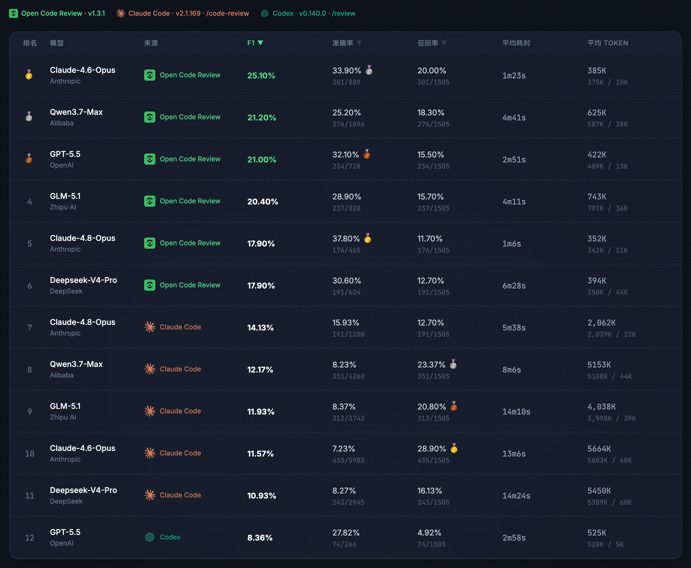

<div align="center">
  <a href="https://alibaba.github.io/open-code-review/">
    
  </a>
  <h1>OpenCodeReview</h1>
</div>

<p align="center">
  <a href="https://trendshift.io/repositories/41087" target="_blank">
    
  </a>
</p>
<p align="center">
  <a href="https://www.npmjs.com/package/@alibaba-group/open-code-review"></a>
  <a href="https://github.com/alibaba/open-code-review/actions/workflows/release.yml"></a>
  <a href="https://goreportcard.com/report/github.com/alibaba/open-code-review"></a>
  <a href="https://github.com/alibaba/open-code-review/blob/main/LICENSE"></a>
  <a href="https://deepwiki.com/alibaba/open-code-review"></a>
  <a href="https://www.bestpractices.dev/projects/13328"></a>
</p>
<p align="center">
  <a href="#supported-platforms"></a>
  <a href="#supported-platforms"></a>
  <a href="#supported-platforms"></a>
  <a href="#supported-agents"></a>
  <a href="#supported-agents"></a>
  <a href="#supported-agents"></a>
</p>
<p align="center">
  <a href="README.md">English</a> | 简体中文 | <a href="README.ja-JP.md">日本語</a> | <a href="README.ko-KR.md">한국어</a> | <a href="README.ru-RU.md">Русский</a>
</p>

---

## Open Code Review 是什么？

Open Code Review 是一款 AI 驱动的代码审查 CLI 工具。它的前身是阿里集团内部官方 AI 代码审查助手，过去两年在内部服务了数万开发者，识别了数百万个代码缺陷。经过大规模充分验证后，我们将其孵化为开源项目，对社区开放。只需配置一个模型端点即可使用。

它读取 Git diff，通过具备工具调用能力的 Agent 将变更文件发送至可配置的 LLM，生成具有行级精度的结构化审查意见。Agent 可以读取完整文件内容、搜索代码库、检查其他变更文件以获取上下文，从而进行深度审查——而非仅停留在表面的 diff 反馈。除了 diff 审查，`ocr scan` 可以审查整个文件，适用于审计不熟悉的代码库或没有有意义 diff 的目录。


## 基准测试

> 相比通用 Agent（Claude Code），Open Code Review 在相同底层模型下取得了显著更高的 **准确率（Precision）** 与 **F1 综合得分**，同时仅消耗 **约 1/9 的 token**、审查更快。但召回率（Recall）低于通用 Agent——这是以精准度换取低噪声的设计取舍。

基于真实场景的代码审查基准测试，从 **50** 个热门开源仓库中精选 **200** 个真实的 Pull Request，覆盖 **10** 种编程语言——由 80+ 位资深工程师交叉标注验证（共 **1,505** 个标注缺陷）。

| 指标 | 含义 | 为什么重要 |
|------|------|-----------|
| **F1** | 准确率与召回率的调和均值 | 综合衡量审查质量的最佳单一指标 |
| **准确率 (Precision)** | 报告的问题中真正有效的比例 | 越高 = 误报越少，减少人工确认成本 |
| **召回率 (Recall)** | 真实缺陷中被发现的比例 | 越高 = 漏报越少，更多问题不会遗漏 |
| **平均耗时 (Avg Time)** | 每次审查的实际耗时 | 决定 CI 流水线的等待时间 |
| **平均 Token (Avg Token)** | 每次审查消耗的总 token 数 | 直接影响 API 使用成本 |



## 为什么选择 Open Code Review？

### 通用 Agent 的局限

如果你深度用过 Claude Code 等通用 Agent + Skills 方案做代码审查，可能对以下问题深有同感：

- **覆盖不全** —— 变更较大时，Agent 倾向于"偷懒"，选择性地审查部分文件，导致遗漏。
- **位置漂移** —— 报告的问题与实际代码位置常常对不上，出现行号或文件偏移。
- **效果不稳定** —— 基于自然语言驱动的 Skills 难以调试，审查质量因提示词的细微差异而大幅波动。

这些问题的根源在于：纯语言驱动的架构缺乏对审查流程的强约束。

### 核心设计：确定性工程 × Agent 混合驱动

Open Code Review 的核心设计理念是将确定性工程与 Agent 结合，各司其职。

**确定性工程——负责强约束**

对代码审查场景中"不能出错"的环节，由工程逻辑而非语言模型来保证：

- **精准的文件筛选** —— 明确哪些文件需要审查、哪些应当过滤，确保真正重要的改动一个不漏。
- **智能的文件打包** —— 将关联文件归并为同一审查单元（例如 `message_en.properties` 与 `message_zh.properties` 会被打包在一起）。每个包会作为 sub-agent 进行任务，它们之间的上下文是隔离的——这一分治策略在超大变更场景下表现更为稳定，同时天然支持并发审查。
- **精细化规则匹配** —— 针对不同文件的特征，匹配对应的审查规则，确保模型的注意力足够聚焦，从源头规避信息噪声的干扰。相比纯语言驱动的规则引导，基于模板引擎的规则匹配行为更稳定、结果更可预期。
- **外挂的定位与反思组件** —— 独立的评论定位模块与评论反思模块，系统性地提升 AI 反馈的位置准确性与内容准确性。

**Agent——负责动态决策**

将 Agent 的优势集中发挥在它真正擅长的地方——动态决策、动态召回上下文：

- **场景化提示词调优** —— 针对代码审查场景深度优化提示词模板，在提升效果的同时有效降低 Token 消耗。
- **场景化工具集沉淀** —— 基于对大量线上数据中工具调用轨迹的深入分析，包括不同工具的调用频率分布、单一工具的重复调用率、新增工具对整体调用链路的影响等多维度分析，从而对通用 Agent 工具集进行取舍与拆分，最终沉淀出一套在代码审查场景下效果更稳定、行为更可预期的专属工具集。

## 如何使用

### CLI

#### 安装

**通过 NPM 安装（推荐）**

```bash
npm install -g @alibaba-group/open-code-review
```

安装后，`ocr` 命令即可全局使用。

**从 GitHub Release 下载**

使用一条命令为你的操作系统/架构安装最新二进制文件（macOS / Linux）：

```bash
curl -fsSL https://raw.githubusercontent.com/alibaba/open-code-review/main/install.sh | sh
```

该脚本会自动选择匹配的发布二进制文件，校验其 SHA-256 校验和，并将其作为 `ocr` 安装到 `/usr/local/bin`。可通过 `OCR_INSTALL_DIR` 覆盖安装目录，或通过 `OCR_VERSION` 指定发布版本：

```bash
OCR_INSTALL_DIR="$HOME/.local/bin" OCR_VERSION=v1.3.13 \
  sh -c "$(curl -fsSL https://raw.githubusercontent.com/alibaba/open-code-review/main/install.sh)"
```

<details>
<summary>手动下载（所有平台，包括 Windows）</summary>

从 [GitHub Releases](https://github.com/alibaba/open-code-review/releases) 下载适用于你平台的二进制文件：

```bash
# macOS (Apple Silicon)
curl -Lo ocr https://github.com/alibaba/open-code-review/releases/latest/download/opencodereview-darwin-arm64
chmod +x ocr && sudo mv ocr /usr/local/bin/ocr

# macOS (Intel)
curl -Lo ocr https://github.com/alibaba/open-code-review/releases/latest/download/opencodereview-darwin-amd64
chmod +x ocr && sudo mv ocr /usr/local/bin/ocr

# Linux (x86_64)
curl -Lo ocr https://github.com/alibaba/open-code-review/releases/latest/download/opencodereview-linux-amd64
chmod +x ocr && sudo mv ocr /usr/local/bin/ocr

# Linux (ARM64)
curl -Lo ocr https://github.com/alibaba/open-code-review/releases/latest/download/opencodereview-linux-arm64
chmod +x ocr && sudo mv ocr /usr/local/bin/ocr

# Windows (x86_64) — 将 ocr.exe 移动到 PATH 目录中
curl -Lo ocr.exe https://github.com/alibaba/open-code-review/releases/latest/download/opencodereview-windows-amd64.exe

# Windows (ARM64) — 将 ocr.exe 移动到 PATH 目录中
curl -Lo ocr.exe https://github.com/alibaba/open-code-review/releases/latest/download/opencodereview-windows-arm64.exe
```

</details>

**从源码构建**

```bash
git clone https://github.com/alibaba/open-code-review.git
cd open-code-review
make build
sudo cp dist/opencodereview /usr/local/bin/ocr
```

#### 快速开始

**1. 配置 LLM**

**在审查代码之前，必须先配置 LLM。**

OCR 通过**供应商（Provider）**模式统一管理 LLM 配置，内置了多种主流供应商，也支持添加自定义供应商以对接私有部署或其他兼容端点。配置存储于 `~/.opencodereview/config.json`。

**方式 A：交互式设置（推荐）**

```bash
ocr config provider          # 选择内置供应商或添加自定义供应商
ocr config model             # 为当前供应商选择模型
```


交互式界面会引导你完成供应商选择、API Key 输入和模型配置，完成后自动测试连通性。

运行 `ocr llm providers` 可查看所有内置供应商。内置供应商预设了 API 地址和协议，只需提供 API Key 即可使用。如果对应的环境变量已设置（如 `ANTHROPIC_API_KEY`、`OPENAI_API_KEY`），API Key 会自动读取，无需手动输入。

添加**自定义供应商**同样通过交互式界面完成 —— 需提供供应商名称、API 地址、协议类型（`anthropic` 或 `openai`）和 API Key。

**方式 B：命令行设置（适用于 CI/CD 等无交互环境）**

通过 `ocr config set` 命令直接写入供应商配置，适用于脚本和自动化场景。

使用内置供应商：

```bash
ocr config set provider anthropic
ocr config set providers.anthropic.api_key your-api-key-here
ocr config set providers.anthropic.model claude-sonnet-4-6
```

使用自定义供应商（对接私有网关或其他兼容端点）：

```bash
ocr config set provider my-gateway
ocr config set custom_providers.my-gateway.url https://my-llm-gateway.internal/v1
ocr config set custom_providers.my-gateway.protocol openai
ocr config set custom_providers.my-gateway.api_key your-api-key-here
ocr config set custom_providers.my-gateway.model gpt-4o
```

> 自定义供应商的 `url` 和 `protocol` 为必填项。`protocol` 支持 `anthropic` 和 `openai` 两种。

可选配置项：

| 键 | 描述 |
|----|------|
| `providers.<name>.auth_header` | 认证头：`x-api-key` 或 `authorization`（默认 `authorization`） |
| `providers.<name>.extra_body` | 合并到请求体的自定义 JSON 字段 |
| `providers.<name>.models` | 用于交互式选择的模型列表 |

**环境变量（优先级最高）**

环境变量会覆盖配置文件中的设置，适用于 CI/CD 场景中不便写入配置文件的情况：

```bash
export OCR_LLM_URL=https://api.anthropic.com/v1/messages
export OCR_LLM_TOKEN=your-api-key-here
export OCR_LLM_MODEL=claude-opus-4-6
export OCR_USE_ANTHROPIC=true
```

同时兼容 Claude Code 环境变量（`ANTHROPIC_BASE_URL`、`ANTHROPIC_AUTH_TOKEN`、`ANTHROPIC_MODEL`），并解析 `~/.zshrc` / `~/.bashrc` 中的相关导出。

> **CC-Switch 用户特别提醒**：如果你使用 [CC-Switch](https://github.com/farion1231/cc-switch) 并开启了[路由服务](https://www.ccswitch.io/zh/docs?section=proxy&item=service)，可以将供应商的 `url` 配置成 CC-Switch 启动的代理地址，无需额外配置：
> - 路由 **Claude** 供应商：`providers.anthropic.url` 设为 `http://127.0.0.1:15721`
> - 路由 **Codex** 供应商：对应供应商的 `url` 设为 `http://127.0.0.1:15721/v1`
> - `api_key` 可设置为任意值，`extra_body` 设置依然生效

**2. 测试连通性**

```bash
ocr llm test
```

**3. 开始审查**

```bash
cd your-project

# 工作区模式 —— 审查所有暂存、未暂存和未跟踪的变更
ocr review

# 分支范围 —— 比较两个引用
ocr review --from main --to feature-branch

# 单个提交
ocr review --commit abc123

# 全量文件扫描 —— 审查整个文件而非 diff（无需 git 历史）
ocr scan                          # 扫描整个仓库
ocr scan --path internal/agent    # 扫描指定目录或文件
```

### 集成到编程 Agent

OCR 可以无缝集成到 AI 编程 Agent 中，作为斜杠命令使用，在 Agent 工作流中直接进行代码审查。

#### 方式一：作为 Skill 安装

使用 `npx` 将 OCR skill 安装到项目中：

```bash
npx skills add alibaba/open-code-review --skill open-code-review
```

此命令从 [skills 注册表](skills/open-code-review/SKILL.md)安装 `open-code-review` skill，教会你的编程 Agent 如何调用 `ocr` 进行代码审查、按优先级分类问题，并可选择性地应用修复。

#### 方式二：作为 Claude Code Plugin 安装

对于 [Claude Code](https://docs.anthropic.com/en/docs/claude-code)，在 Claude Code 中通过以下命令安装命令插件：

```bash
/plugin marketplace add alibaba/open-code-review
/plugin install open-code-review@open-code-review
```

此命令注册 `/open-code-review:review` 斜杠命令，运行 OCR 并自动过滤和修复问题。

#### 方式三：作为 Codex Plugin 安装

对于本地 Codex，可以从此仓库安装 Open Code Review plugin：

```bash
codex plugin marketplace add alibaba/open-code-review
codex
/plugins
```

对于本地 checkout 或 fork：

```bash
codex plugin marketplace add .
codex
/plugins
```

安装并启用 `Open Code Review` 后，启动新的 Codex thread 并显式调用：

```text
@Open Code Review review my current changes
@Open Code Review review this branch against main
@Open Code Review review and fix high-confidence issues
```

这会注册一个 Codex skill，用于运行本地 OCR CLI：

```bash
ocr review --audience agent
```

此集成不会改变 OCR 的内部 LLM backend，也不需要为 Codex 配置 OpenAI Responses API endpoint。OCR 本身仍需要按照 CLI setup 部分安装并配置 `ocr` CLI。

韩文指南：[`plugins/open-code-review/CODEX.ko-KR.md`](plugins/open-code-review/CODEX.ko-KR.md)

#### 方式四：作为 Cursor Plugin 安装

对于 [Cursor](https://www.cursor.com/)，可以从此仓库安装 Open Code Review plugin：

```
cursor-plugin marketplace add alibaba/open-code-review
```

也可以手动添加 marketplace。在 Cursor 中打开 `/plugins`，搜索 `Open Code Review` 并安装。

对于本地 checkout 或 fork：

```
cursor-plugin marketplace add .
```

安装后，在 Cursor 中调用：

```text
@Open Code Review review my current changes
@Open Code Review review this branch against main
@Open Code Review review and fix high-confidence issues
```

这会注册一个 Cursor skill，用于运行本地 OCR CLI：

```bash
ocr review --audience agent
```

此集成不会改变 OCR 的内部 LLM backend。OCR 本身仍需要按照 CLI setup 部分安装并配置 `ocr` CLI。

#### 方式五：直接复制命令文件

如果不想使用任何包管理器，可以直接复制命令文件，在 Claude Code 中使用 `/open-code-review` 斜杠命令。

**项目级**（通过 git 与团队共享）：

```bash
mkdir -p .claude/commands
curl -o .claude/commands/open-code-review.md \
  https://raw.githubusercontent.com/alibaba/open-code-review/main/plugins/open-code-review/commands/review.md
```

**用户级**（个人全局使用，适用于所有项目）：

```bash
mkdir -p ~/.claude/commands
curl -o ~/.claude/commands/open-code-review.md \
  https://raw.githubusercontent.com/alibaba/open-code-review/main/plugins/open-code-review/commands/review.md
```

> **前置条件**：所有集成方式都需要安装 `ocr` CLI 并配置 LLM。参见上方[安装](#安装)和[配置 LLM](#1-配置-llm)。

### CI/CD 集成

OCR 可以集成到 CI/CD 流水线中，在 Merge Request / Pull Request 时自动进行代码审查。

CI 集成的核心命令：

```bash
ocr review \
  --from "origin/main" \
  --to "origin/feature-branch" \
  --format json
```

`--format json` 参数输出适合 CI 脚本解析的机器可读结果。

集成示例请参见 [`examples/`](./examples/) 目录：

- [`github_actions/`](./examples/github_actions/) — GitHub Actions 集成示例
- [`gitlab_ci/`](./examples/gitlab_ci/) — GitLab CI 集成示例

## 命令

| 命令 | 别名 | 描述 |
|------|------|------|
| `ocr review` | `ocr r` | 开始基于 diff 的代码审查 |
| `ocr scan` | `ocr s` | 审查整个文件（无需 diff） |
| `ocr rules check <file>` | — | 预览某个文件路径生效的审查规则 |
| `ocr config provider` | — | 交互式供应商设置（内置、自定义或手动） |
| `ocr config model` | — | 为当前供应商交互式选择模型 |
| `ocr config set <key> <value>` | — | 设置配置项 |
| `ocr config unset custom_providers.<name>` | — | 删除自定义供应商 |
| `ocr llm test` | — | 测试 LLM 连通性 |
| `ocr llm providers` | — | 列出内置 LLM 供应商 |
| `ocr viewer` | `ocr v` | 启动 WebUI 会话查看器，地址 `localhost:5483` |
| `ocr version` | — | 显示版本信息 |

### `ocr review` 参数

| 参数 | 缩写 | 默认值 | 描述 |
|------|------|--------|------|
| `--repo` | — | 当前目录 | Git 仓库根目录 |
| `--from` | — | — | 源引用（如 `main`） |
| `--to` | — | — | 目标引用（如 `feature-branch`） |
| `--commit` | `-c` | — | 审查单个提交 |
| `--exclude` | — | — | 以逗号分隔的 gitignore 风格模式，用于跳过匹配文件；与 rule.json 中的 excludes 合并 |
| `--preview` | `-p` | `false` | 预览将被审查的文件列表，不调用 LLM |
| `--format` | `-f` | `text` | 输出格式：`text` 或 `json` |
| `--concurrency` | — | `8` | 最大并发文件审查数 |
| `--timeout` | — | `10` | 并发任务超时时间（分钟） |
| `--audience` | — | `human` | `human`（显示进度）或 `agent`（仅输出摘要） |
| `--background` | `-b` | — | 可选的需求/业务背景信息；使用 `--commit` 时如未指定则自动从 commit message 中提取 |
| `--model` | — | — | 为本次审查选择或覆盖 LLM 模型 |
| `--rule` | — | — | 自定义 JSON 审查规则路径 |
| `--max-tools` | — | 内置默认 | 每个文件的最大工具调用轮次；仅在大于模板默认值时生效 |
| `--max-git-procs` | — | 内置默认 | 最大并发 git 子进程数 |
| `--tools` | — | — | 自定义 JSON 工具配置路径 |

### `ocr scan` 参数

`ocr scan` 审查整个文件而非 diff —— 适用于审计不熟悉的代码库、迁移前扫描，或任何没有有意义 diff 的目录。它也可以在非 git 目录中工作（会回退到遵循 `.gitignore` 的文件系统遍历）。

| 参数 | 缩写 | 默认值 | 描述 |
|------|------|--------|------|
| `--path` | — | 整个仓库 | 以逗号分隔的待扫描目录/文件 |
| `--exclude` | — | — | 以逗号分隔的 gitignore 风格模式，用于跳过匹配文件；与 rule.json 中的 excludes 合并 |
| `--preview` | `-p` | `false` | 列出将被扫描的文件，不运行 LLM |
| `--max-tokens-budget` | — | `0`（无限制） | 限制总 token 使用量；超出后停止分发 |
| `--no-plan` | — | `false` | 跳过按文件的规划预处理 |
| `--no-dedup` | — | `false` | 跳过按批次的相似评论去重 |
| `--no-summary` | — | `false` | 跳过项目级别的总结 |
| `--batch` | — | `by-language` | 批处理策略：`none`、`by-language` 或 `by-directory` |
| `--format` | `-f` | `text` | 输出格式：`text` 或 `json`（JSON 包含 `project_summary` 字段） |
| `--concurrency` | — | `8` | 最大并发文件扫描数 |
| `--rule` | — | — | 自定义 JSON 审查规则路径 |
| `--repo` | — | 当前目录 | 要扫描的仓库或目录根路径 |

每次运行前，`ocr scan` 会打印粗略的 token 费用估算。使用 `--preview` 先查看文件列表，使用 `--max-tokens-budget` 限制大型仓库的开销。

## 示例

```bash
# 交互式供应商和模型设置
ocr config provider
ocr config model
ocr llm providers

# 删除自定义供应商
ocr config unset custom_providers.my-gateway

# 预览将被审查的文件（不调用 LLM）
ocr review --preview
ocr review -c abc123 -p

# 使用默认设置审查工作区变更
ocr review

# 以更高并发审查分支差异
ocr review --from main --to my-feature --concurrency 4

# 审查特定提交并以 JSON 格式输出详细信息
ocr review --commit abc123 --format json --audience agent

# 为本次审查选择或覆盖模型
ocr review --model claude-opus-4-6
ocr review --commit abc123 --model claude-sonnet-4-6

# 提供需求背景以获得更有针对性的审查
ocr review --background "为登录 API 添加限流"

# 使用自定义审查规则
ocr review --rule /path/to/my-rules.json

# 预览某个文件路径生效的规则
ocr rules check src/main/java/com/example/Foo.java
ocr rules check --rule custom.json src/main/resources/mapper/UserMapper.xml

# 全量文件扫描：先预览文件列表（不调用 LLM）
ocr scan --preview

# 扫描整个仓库，限制消耗约 500k token
ocr scan --max-tokens-budget 500000

# 扫描子目录，跳过生成的/测试文件
ocr scan --path internal --exclude '**/*_test.go,**/generated/**'

# 扫描非 git 目录，使用 JSON 输出（包含 project_summary）
ocr scan --repo /path/to/plain/dir --format json

# 最快扫描：跳过规划、去重和项目总结
ocr scan --no-plan --no-dedup --no-summary

# 在浏览器中查看审查会话历史
ocr viewer
ocr viewer --addr :3000
```

## 评审规则

OCR 通过四层优先级链解析评审规则。每层采用首次匹配原则：如果文件路径匹配到某个模式，则使用该规则；否则穿透到下一层。

| 优先级 | 来源 | 路径 | 描述 |
|--------|------|------|------|
| 1（最高） | `--rule` 参数 | 用户指定路径 | CLI 显式覆盖 |
| 2 | 项目配置 | `<repoDir>/.opencodereview/rule.json` | 项目级规则，可提交到 git |
| 3 | 全局配置 | `~/.opencodereview/rule.json` | 用户级个人偏好 |
| 4（最低） | 系统默认 | 内嵌 `system_rules.json` | 覆盖常见语言和文件类型的内置规则 |

### 规则文件格式

第 1–3 层使用相同的 JSON 格式：

```json
{
  "rules": [
    {
      "path": "force-api/**/*.java",
      "rule": "所有新方法必须对必填参数进行空值校验",
      "merge_system_rule": true
    },
    {
      "path": "**/*mapper*.xml",
      "rule": "检查 SQL 注入风险、参数错误和缺少闭合标签"
    }
  ]
}
```

- `path` 支持 `**` 递归匹配和 `{java,kt}` 大括号展开。
- `merge_system_rule` 为可选字段。设为 `true` 时，命中的内置系统规则会与该用户规则合并；否则用户规则会替换系统规则。
- 在每一层内，规则按声明顺序评估 —— 首次匹配生效。
- 如果规则文件不存在，将被静默跳过。

**`rule` 字段同时支持内联内容和文件路径。**系统按以下顺序自动判断：

1. 如果值包含换行 → **内联内容**（多行规则永远不会被当作文件路径）。
2. 如果值是单行、不含空格、且以 `.md` / `.txt` / `.markdown` 结尾 → **文件路径**。
   - 绝对路径（以 `/` 开头）直接使用。
   - 相对路径在项目根目录下查找，找不到则 `[WARN]` 并清空该规则（不会回退为内联）。
   - 文件需通过安全校验：白名单扩展名、≤ 512 KB、symlink 解析后目标也必须是白名单扩展名。校验失败则清空该规则。
3. 否则 → **内联内容**。

```json
{
  "rules": [
    {
      "path": "**/*mapper*.xml",
      "rule": "docs/sql-rules.md"
    },
    {
      "path": "**/*.java",
      "rule": "始终检查空值安全和资源泄漏"
    },
    {
      "path": "**/*.go",
      "rule": "shared/go-concurrency.md"
    },
    {
      "path": "**/*.py",
      "rule": "/Users/me/team-rules/python.md"
    }
  ]
}
```

- `docs/sql-rules.md` — 相对路径，从 `<project>/docs/sql-rules.md` 加载。
- `始终检查空值安全…` — 内联字符串，直接使用。
- `shared/go-concurrency.md` — 相对路径，同上。
- `/Users/me/team-rules/python.md` — 绝对路径，直接使用。
> 绝对路径可以访问项目目录之外的文件，这是有意为之的设计——`rule.json` 由项目维护者编写，属于受信输入。团队可将共享规则放在统一路径下（如 `/opt/company-rules/`），无需在各项目中复制。

### 路径过滤

规则文件同时支持 `include` 和 `exclude` 字段，用于控制哪些文件进入审查范围：

```json
{
  "rules": [
    {"path": "**/*.java", "rule": "检查空值安全"}
  ],
  "include": ["src/main/**/*.java", "lib/**/*.kt"],
  "exclude": ["**/generated/**", "vendor/**"]
}
```

**过滤决策优先级（从高到低）：**

| 步骤 | 条件 | 结果 |
|------|------|------|
| 1 | 文件为二进制文件 | 排除 |
| 2 | 路径匹配用户 `exclude` 模式 | 排除 |
| 3 | 文件扩展名不在支持列表中 | 排除 |
| 4 | 配置了 `include` 且路径匹配 | **纳入审查**（跳过步骤 5） |
| 5 | 路径匹配内置默认排除模式（测试文件等） | 排除 |
| 6 | 以上均不满足 | 纳入审查 |

**生效逻辑：**

- `include` 和 `exclude` 遵循与评审规则相同的优先级链（`--rule` > 项目配置 > 全局配置），取**最高优先级中配置了 include/exclude 的那一层**整体生效，不会跨层合并。
- `exclude` 始终优先于 `include` —— 同时匹配两者的文件会被排除。
- `include` 的作用是**绕过内置默认排除模式**（如测试文件），而非限制审查范围 —— 未匹配 `include` 的文件仍会正常进入后续的默认过滤判断。
- 模式语法：支持 `**` 递归匹配、`*` 单级匹配和 `{a,b}` 大括号展开，匹配时不区分大小写。

**内置默认排除模式**（用于过滤测试文件等，可通过 `include` 覆盖）：

```
**/*_test.go, **/*Test.java, **/*Tests.java, **/*_test.rs,
**/*.test.{js,jsx,ts,tsx}, **/*.spec.{js,jsx,ts,tsx}, **/__tests__/**,
**/src/test/java/**/*.java, **/src/test/**/*.kt,
**/test/**/*_test.py, **/tests/**/*_test.py, **/*_test.py,
**/*_spec.rb, **/spec/**/*_spec.rb, **/oh_modules/**
```

## 配置参考

配置文件：`~/.opencodereview/config.json`

| 键 | 类型 | 示例 |
|----|------|------|
| `provider` | string | `anthropic` \| `openai` \| `dashscope` \| `deepseek` \| `z-ai` |
| `providers.<name>.api_key` | string | 供应商 API 密钥 |
| `providers.<name>.url` | string | 供应商 Base URL 覆盖 |
| `providers.<name>.protocol` | string | `anthropic` \| `openai` |
| `providers.<name>.model` | string | 供应商模型名称 |
| `providers.<name>.models` | array | 用于交互式选择的可选供应商模型列表 |
| `providers.<name>.auth_header` | string | `x-api-key` \| `authorization` |
| `custom_providers.<name>.*` | — | 与 `providers.<name>.*` 相同的字段，包括可选的 `models` |
| `llm.url` | string | `https://api.openai.com/v1/chat/completions` |
| `llm.auth_token` | string | `sk-xxxxxxx` |
| `llm.auth_header` | string | 仅 Anthropic：`x-api-key` \| `authorization` |
| `llm.model` | string | `claude-opus-4-6` |
| `llm.use_anthropic` | boolean | `true` \| `false` |
| `language` | string | 任意语言名称，例如 `English`、`Chinese`（默认：`English`） |
| `telemetry.enabled` | boolean | `true` \| `false` |
| `telemetry.exporter` | string | `console` \| `otlp` |
| `telemetry.otlp_endpoint` | string | OTLP 采集器地址 |
| `telemetry.content_logging` | boolean | 在遥测数据中包含提示词 |

环境变量优先级高于配置文件。

### 环境变量

| 变量 | 用途 |
|------|------|
| `OCR_LLM_URL` | LLM API 端点 URL |
| `OCR_LLM_TOKEN` | API 密钥 / 认证令牌 |
| `OCR_LLM_AUTH_HEADER` | Anthropic 认证头（`x-api-key` 或 `authorization`） |
| `OCR_LLM_MODEL` | 模型名称 |
| `OCR_USE_ANTHROPIC` | `true` = Anthropic，`false` = OpenAI |


## 遥测

OpenTelemetry 集成，用于可观测性（spans、metrics）。默认关闭。

```bash
ocr config set telemetry.enabled true
ocr config set telemetry.exporter otlp
ocr config set telemetry.otlp_endpoint localhost:4317
```

设置 `telemetry.content_logging` 可在导出数据中包含 LLM 提示词和响应。

## 贡献

参见 [CONTRIBUTING.zh-CN.md](CONTRIBUTING.zh-CN.md) 了解开发环境搭建、编码规范以及如何提交 Pull Request。

## Star History

[](https://star-history.com/#alibaba/open-code-review&Date)

## 许可证

[Apache-2.0](LICENSE) — Copyright 2026 Alibaba
